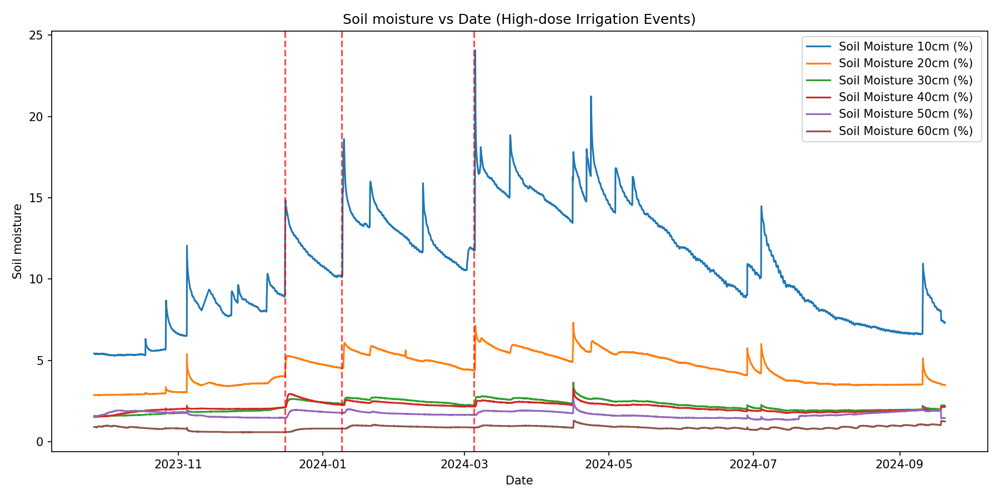
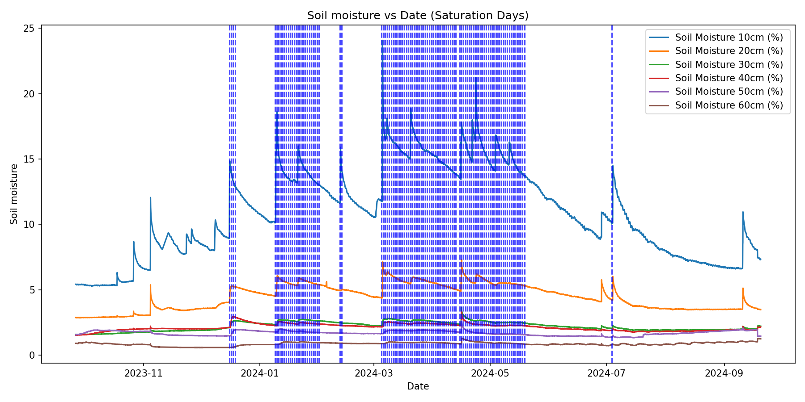

# Soil Moisture Analysis

[This](soil_analysis.py) script automates the workflow of sending sensor data to the OpenAgri IRM service, retrieving analysis results, and (optionally) plotting soil moisture time-series.

## Features
- **CSV Parsing**: Reads a CSV file with soil moisture, rainfall, temperature, and humidity measurements. It permits robustness in the CSV column order and naming (eg soil_moisture_30 or "Soil Moisture 30" or "Soil Moisture 30 %"). It permits a depth column is missing by adding internally this column with default value 0 (this behaviour will be altered soon).
- **Payload Builder**: Normalizes soil moisture columns (supports flexible headers like `Soil Moisture 30cm (%)`) and fills missing depths with zeros.
- **API Calls**:
  - Posts the CSV data to `/api/v1/dataset/`.
  - Fetches analysis results from `/api/v1/dataset/{dataset_id}/analysis`.
- **Optional Plotting**: Plots soil moisture vs. date, adding vertical lines for irrigation events (red) and saturation days (blue).
- **No unnecessary dependencies**: Requires only `requests`. If `--plot` is used, then `matplotlib` must be installed.

## Usage

1. Install requirements:
   ```bash
   pip install requests pandas matplotlib
   ```

2. Run the script:

```bash
python soil_analysis.py \
  --csv ./OpenAgriIoTsensorsrecordings2024two.csv \
  --base-url https://irm.test.horizon-openagri.eu \
  --token YOUR_BEARER_TOKEN \
  --dataset-id test_dataset
```

3. To enable plotting:

```bash
python soil_analysis ... --plot
```

## Arguments

`--csv` : Path to the CSV file containing sensor data.
`--base-url` : Base URL of the service (e.g. http://localhost:8005).
`--token` : Bearer token for authentication.
`--dataset-id` : Identifier for the dataset (string).
`--plot` : If given, generate and save plots as PNG files.

## Outputs

Prints POST and GET responses (truncated) to the console.

If `--plot` is enabled, generates two PNG files:
- soil_moisture_irrigation_events.png
- soil_moisture_saturation_days.png

which represent the soil moisture data of the original dataset along with the events
where high dose irrigation and saturation days found.

## High Dose Irrigation Events



**What it shows**

Multiple lines — one per soil depth (10–60 cm) — representing soil moisture over time.

Red dashed vertical lines — timestamps returned by the analysis as high-dose irrigation events.

**How to read it**

Look for immediate increases in the shallow depths (e.g., 10–20 cm) right after a red line; that typically indicates irrigation water reaching the upper layers.

Delayed or muted response in deeper lines (e.g., 40–60 cm) suggests slower infiltration or limited percolation.

If a red line appears but the moisture lines don’t rise, check:

- Sensor reliability or calibration,
- Data timestamp alignment,
- Event timing/volume vs. sampling frequency.

## Saturation Days



**What it shows**

The same soil moisture curves by depth as above.

Blue dashed vertical lines marking saturation days detected in the analysis.

**How to read it**

Around each blue line, soil moisture values may plateau, often indicating near-field capacity or saturation.

Repeated saturation markers without a corresponding drying trend might indicate:

- Poor drainage or compacted soil,
- Over-irrigation,
- High water table conditions.

If saturation triggers frequently follow irrigation events, consider adjusting irrigation volume/frequency, especially if deeper layers remain persistently high.

## Notes & Assumptions

The script requires rain, temperature, and humidity columns. If not found (including common aliases), it will raise a clear error.

Date parsing assumes consistent ISO-like timestamps (e.g., 2025-09-30T16:56:05Z). If your format differs, update the date parsing helper accordingly.

Missing soil moisture depths are filled with zeros in the payload and appear as flat zero lines in plots (helpful for completeness checks).

The analysis keys may differ slightly (e.g., misspellings or alternative naming). The script tolerates common variants.